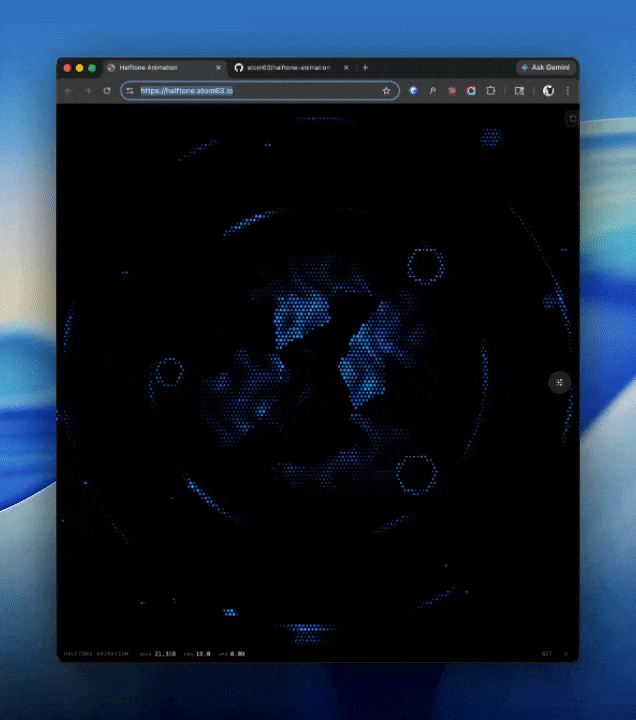

# halftone animation

**[halftone.atom63.io](https://halftone.atom63.io)**



An animated halftone dot field rendered on a `<canvas>` — with a live parameter panel to tweak everything in real time.

By [You Zhang](https://atom63.io) · [ATOM63](https://github.com/atom63)

---

## Features

- **60fps canvas renderer** — pure math, no WebGL
- **Entry animation** — expanding shockwave reveal on load, with replay
- **Organic structure** — Gaussian blob cells, concentric rings, Voronoi-textured core
- **Shape morphing** — square / circle / triangle SDFs that interpolate between each other
- **Cursor interaction** — hover ripples and trail that disturb the dot field
- **Live parameter panel** — click the dial icon (bottom-right of canvas) to open; tweak anything in real time and hit Reset to restore defaults
- **Light and dark mode** — follows `prefers-color-scheme`, toggle in the header
- **`prefers-reduced-motion`** — freezes at the settled idle frame

## Getting started

```bash
npm install
npm run dev
```

Or with pnpm:

```bash
pnpm install
pnpm dev
```

Open [http://localhost:5173](http://localhost:5173).

## Scripts

| Command | Description |
| --- | --- |
| `dev` | Start Vite dev server |
| `build` | Type-check and build for production |
| `preview` | Preview the production build locally |
| `lint` | Lint with Biome |
| `typecheck` | Type-check without emitting |

## Stack

- [React 19](https://react.dev)
- [Vite 7](https://vite.dev)
- [DialKit](https://www.npmjs.com/package/dialkit) — live parameter panel
- [Lucide React](https://lucide.dev) — icons
- [Biome](https://biomejs.dev) — linting and formatting
- TypeScript

## License

MIT © [You Zhang](https://atom63.io)
